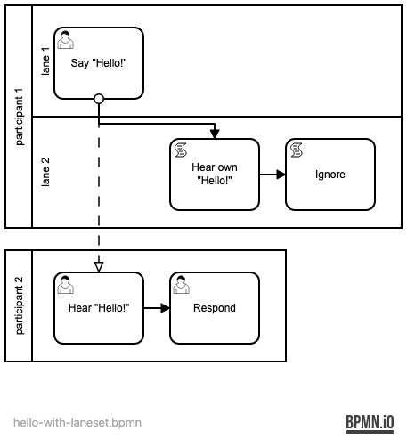
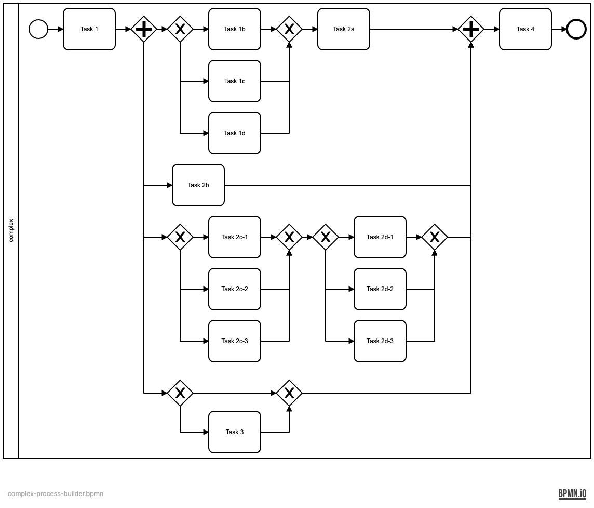
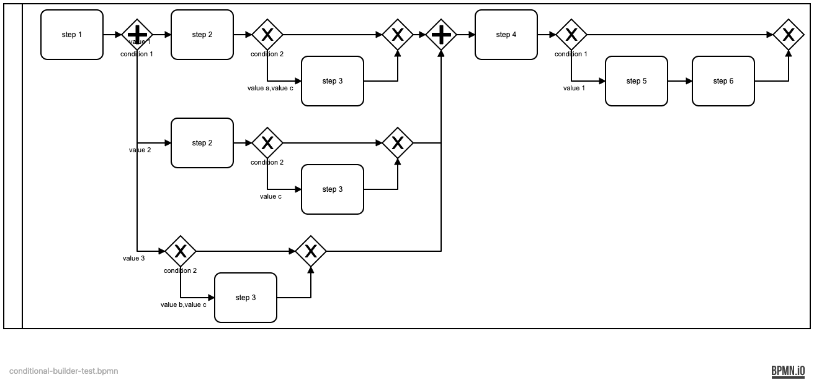

# What's in The Box?

BPMN Tools (currently) consists of:

## An Object Model

The base object model mimicks the XML structure of BPMN. It allows for creating BPMN models and consists of the following modules and classes:

* notation
  * Definitions
* collaboration
  * Participant
  * Collaboration
* flow
  * Flow and MessageFlow
  * Start and End
  * Task, UserTask, ServiceTask, SendTask, ReceiveTask, ManualTask, BusinessRuleTask, ScriptTask
  * ExclusiveGateway, InclusiveGateway, ParallelGateway
  * Process
* diagrams
  * Diagram
  * Plane
  * Shape and Edge
  
Most other XML tags are also available. `bpmn-tools` tries to remove as much of the clutter as possible and follows some conventions to allow you to focus on the essencials/bare minimum.

## Simple Layouting

A first, simple layout function allows for automatically arranging shapes and edges:



## A Directed Acyclic Graph-like Process Builder

If your processes adhere to [DAG-like flows](https://en.wikipedia.org/wiki/Directed_acyclic_graph), you can also use a (first) `process` builder. It provides an alternative object model (which in its turn uses the base object model) and allows you to specify the bare minimum, with a compact and fluid API:

```python
process = Process([
  Task(name="Task 1"),
  Branch([
    Process([
      Branch([
        Task(name="Task 1b"),
        Task(name="Task 1c"),
        Task(name="Task 1d")
      ]),
      Task(name="Task 2a")
    ]),
    Task(name="Task 2b"),
    Process([
      Branch([
        Task(name="Task 2c-1"),
        Task(name="Task 2c-2"),
        Task(name="Task 2c-3")
      ]),
      Branch([
        Task(name="Task 2d-1"),
        Task(name="Task 2d-2"),
        Task(name="Task 2d-3")
      ])
    ]),
    Branch([
      Task(name="Task 3")
    ], default=True)
  ], kind=BranchKind.AND),
  Task(name="Task 4")
], name="complex", starts=True, ends=True)

model = process.render()
```

And this produces the following result:



## A Conditional Sequential Tasks Builder

Raising the builder abstraction one more level, the conditional sequential tasks builder (short: `conditional`) lets you simply define a sequence of tasks, each with conditions. The result is a "flow" with conditional branches, generated using the `process` builder:

```python
sequence = Sequence().expand(
  Item("step 1"),
  Item("step 2", ConditionSet(
    [Condition("condition 1", ConditionKind.AND)],
    [["value 1"], ["value 2"]]
  )),
  Item("step 3", ConditionSet(
    [Condition("condition 1"), Condition("condition 2")],
    [["value 1", "value a"], ["value 3", "value b"], [None, "value c"]]
  )),
  Item("step 4"),
  Item("step 5", ConditionSet(
    [Condition("condition 1")],
    [["value 1"]]
  )),
  Item("step 6", ConditionSet(
    [Condition("condition 1")],
    [["value 1"]]
  )),    
)

process = sequence.to_process()
model = process.render()
```



More to come...
